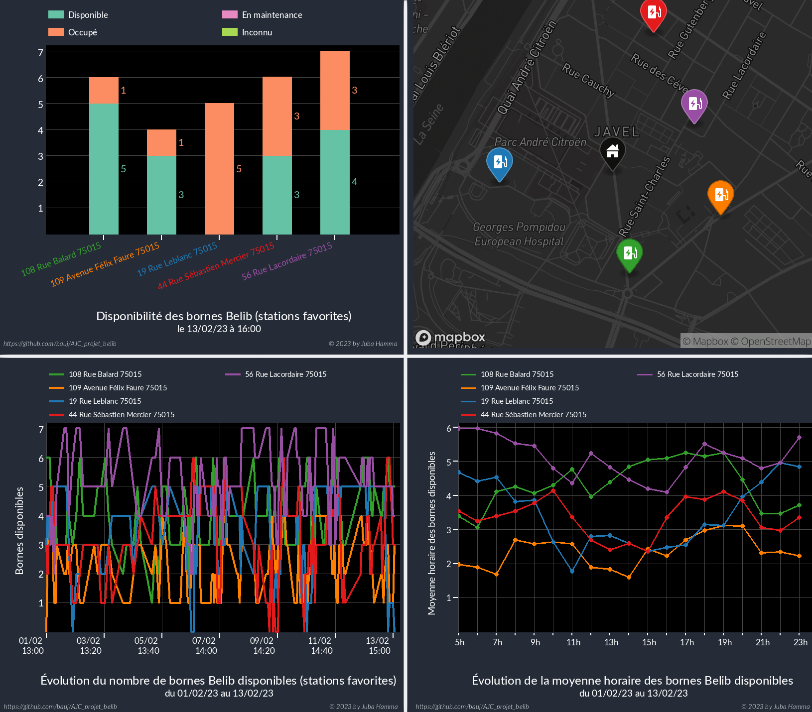

# Traitement de données Belib'

Ce projet avait pour but de traiter des données en Open data dynamique sur une 
carte embarquée de type Raspberry Pi de manière automatique. Le data set 
choisi : [Statut des bornes Belib' parisiennes](https://parisdata.opendatasoft.com/explore/dataset/belib-points-de-recharge-pour-vehicules-electriques-disponibilite-temps-reel/information/?disjunctive.statut_pdc&disjunctive.arrondissement)
+ Deux besoins créés à partir du dataset :
    1. Disponibilité des bornes de stations en favoris définies autour d'une 
position dans un périmètre donné par un rayon de recherche
    2. Tracé de la moyenne horaire de la disponibilité des bornes dans ces 
stations favorites.  
 
+ Deux étapes majeures :
    1. Récolte, traitement et stockage des données : Python (urllib3, ujson, sqlite3)
    2. Génération de figures pour visualiser les données : C (sqlite3, libgd)  
+ Pour compléter ce projet : 
    + Ajout d'une carte géographique localisant les stations favorites, ainsi 
que la position de recherche (API Mapbox).
    + Ajout d'une fonctionnalité interactive : trouver des stations en 
spécifiant une adresse et un rayon de recherche -> renvoie un instantané de la 
disponibilité des bornes dans ces stations.

+ Exemple de figures obtenues avec libgd (langage C) :
  

## Récupération et traitement des données brutes :heavy_check_mark: 

### Création d'une base de données SQLite3 `belib_data.db` comprenant 4 tables

+ **Table Bornes** : contient l'ensemble des données des bornes Belib. 
Cette table est mise à jour quotidiennement à 17h20. Il s'agit d'une **table 
temporaire**, sauvegardée dans le cas où l'on souhaite exploiter plus de 
données dans la suite du projet. Elle n'est pas mise à jour sur la carte qemu.  
En-tête de la table :  

| ID | last_updated | id_pdc | statut_pdc | adresse_station | lon | lat |
| --- | --- | --- | --- | --- | --- | --- |

+ **Table General** : contient le nombre total de bornes associées à chaque
statut : disponible, occupé, en maintenance, etc ... Cette table est utilisée 
pour un affichage qui permet un aperçu global du service.  
En-tête de la table :  

| ID | date_recolte | disponible | occupe | en_maintenance | ... |
| --- | --- | --- | --- | --- | --- |

+ **Table Stations_fav** : contient les données de stations Belib 
enregistrées autour d'un lieu favori inséré dans l'application. Les données 
sont récupérées 3x par jour (9h40, 12h, 17h20) via **crontab** et permettent de
 tracer une évolution temporelle du statut de ces bornes pour ces 3 moments de 
la journée.   
*[Perspectives] Ajout de la possibilite d'ajouter des favoris.*  
*[Perspectives] On pourrait penser à inclure la possibilite de modifier les 
horaires de recuperation.*  
En-tête de la table :  

| ID | date_recolte | adresse_station | lon | lat | disponible | occupe | ... |
| --- | --- | --- | --- | --- | --- | --- | --- |

+ **Table Stations_live** : contient les données de stations Belib 
trouvées suite à la requête d'un utilisateur. Elle est nettoyée au lancement 
d'une requête pour ne garder que les résultats voulus.  
*[Perspectives] Tracer l'historique des bornes trouvées ? est-ce utile ?*  
En-tête de la table :  

| ID | date_recolte | adresse_station | lon | lat | disponible | occupe | ... |
| --- | --- | --- | --- | --- | --- | --- | --- |

### Récupération et injection des données dans la BDD (Base de Données) 

+ Récupération et injection des données `belib_data.db` dans chaque table de la 
bdd à l'aide du script python `recuperation_data_belib.py`. Bibliothèques 
python (modules) utilisées : 
    + **urllib3** : pour effectuer les requêtes GET sur les API [OpenDatasoft 
de ParisData](https://parisdata.opendatasoft.com/api/v2/console), [Adresse de 
data gouv](https://adresse.data.gouv.fr/api-doc/adresse), et [Static Images de 
mapbox](https://docs.mapbox.com/playground/static/).  

    + **ujson** : UltraJSON, pour le traitement des contenus JSON renvoyés par 
les requêtes. Bibliothèque de traitement de JSON ultrarapide et légère.  

    + **sqlite3**  : pour l'interfaçage avec la bdd `belib_data.db`.  

    + **datetime** : pour des traitements de chaines de type `date`.  

    + **argparse** : pour parser simplement les arguments entré via appel CLI.

### Options de récupération des données

+ Quatre options de récupération sont possibles avec le script 
`recuperation_data_belib.py` en fonction de la table de la bdd visée :
    + `-b` `--bornes` : récupération des données de l'ensemble des bornes et 
injection dans la **table Bornes** de la bdd.  

    + `-g` `--general` : récupération des données de l'ensemble des bornes 
groupées par statut et injection dans la **table General** de la bdd.  

    + `-f` `--favoris` : récupération des données des stations en favori et 
injection  dans la **table Stations_fav** de la bdd.  

    + `-l` `--live` : récupération des données des stations situées dans un 
rayon `<distance>` de l'adresse `<adresse>` entrée et injection dans la **table 
Stations_live** de la bdd.
        + `-a` `--adresse` <adresse>   : permet d'entrer une `<adresse>` sous 
la forme d'une chaine de caractères. 
        + `-d` `--distance` <distance> : permet d'entrer une `<distance>` sous
 la forme d'une chaine de caractères (de type "0.5km").

## Lecture bdd sqlite et plotting      :heavy_check_mark:
 
+ Section réalisée en C avec les bibliothèques sqlite3 et libgd. 
+ Proof of concept : Exec cross-compilé avec ouverture et fermetude de db 
sqlite + plot tracé et sauvegarde d'une image en png 
+ Plot de deux figures (*pour l'instant*) en utilisant la bibliothèque matplotlib
    + Fig 1 : Evolution temporelle du nombre de points de charge disponibles, 
occupés et en maintenance (courbes) pour les stations en favoris.
    + Fig 2 : Histogramme des statuts des points de charge des stations favs au
moment de la derniere recolte.

+ Construction de tout une bibliotheque de plot permettant une utilisation 
simple de GD.

+ Fichiers figures enregistrés au format PNG.

+ Passer un coup de Valgrind + ElectricFence :heavy_check_mark:

## Recuperation map statique avec marqueurs :heavy_check_mark:

+ Utilisation de l'API mapbox

+ Recuperation d'une carte statique avec les marqueurs sur les positions GPS 
des stations.

## Update page HTML et CSS      :heavy_check_mark:
+ Un peu d'HTML et de CSS pour mettre en valeur les résultats, décrire le projet, etc ...

## Mise en place de l'ensemble du projet sur la carte embarquée (voir Overlay_BR)  :heavy_check_mark:

+ Recuperation des data : :heavy_check_mark:
    + environ 4 secs  par appel.
    + bdd de faible taille : incrément inférieur à 1ko pour les favoris (5 stations)

+ Bibliotheques utilisees :
    + **Python** : sqlite3, urllib3 (ssl et CA Certificates), ujson, sqlite3.
    + **C** : libgd, sqlite3.

+ Automatisation via script Sh dans crontab : done. 

## Ajout de la possibilité de trouver des stations autour d'une adresse  :heavy_check_mark:

+ Script CGI sh permettant d'executer un update des figures live (et de la table Stations_live de la db)

## Perspectives
+ Moyenne par jour de bornes disponibles, à certaines heures :heavy_check_mark:
+ Porter sur carte réelle, yocto (... en cours)

